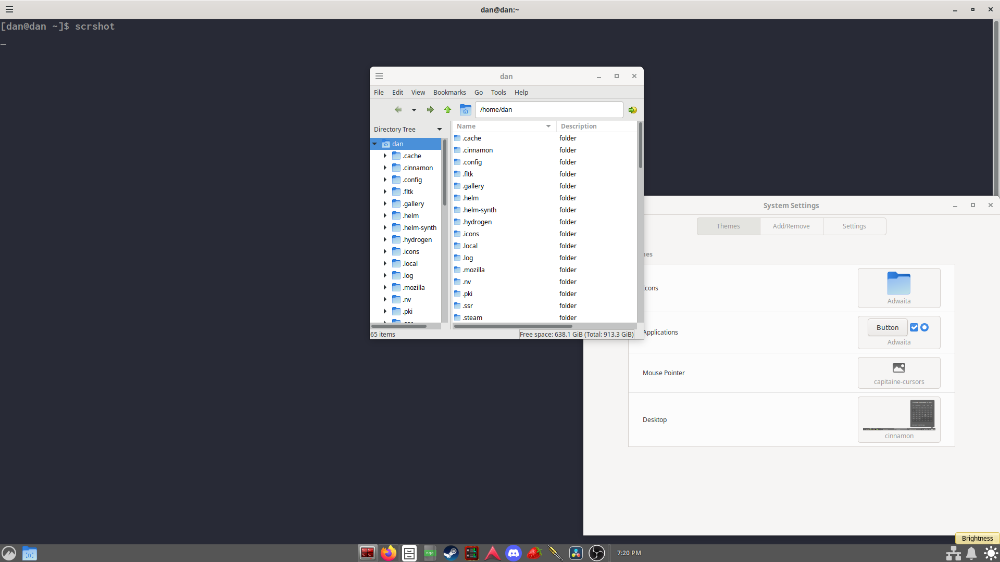

# How to make cinnamon look nice
General options and setup configuration for the Cinnamon desktop environment

## Introduction
### Cinnamon
Cinnmon is a great Desktop Environment(or DE) madeby the Linux Mint team. I personally love it and I think it's the only desktop environment worth using, just because it's so minimal and straightforward.

**This is not a Cinnamon tutorial. This is just for cinnamon's customization options.**

